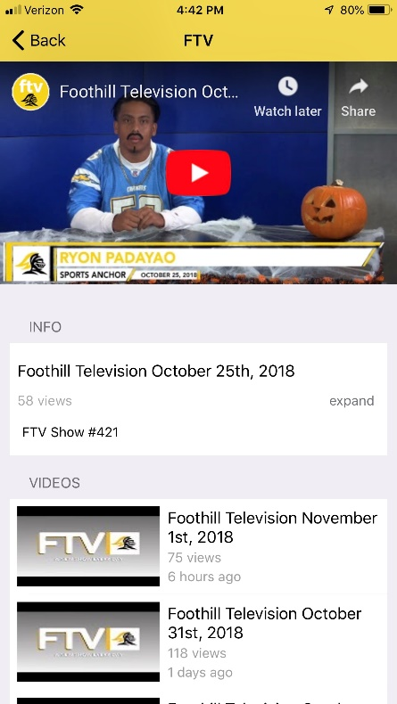

Cross-Platform Mobile Application for Students, Parents, and Faculty
====================================================================

Jake R. Johnson
---------------

#### **1. Brief Purpose**

The Foothill Mobile App digitizes archaic systems of student-to-teacher
interactions and multi-app requirements for Grade-Access, staff
directories, Foothill media outreach and sports scheduling. The app
congregates these features into a single app, avoiding the need for
ledgers and reducing tedious efforts by the ASB Student Government to
manage outlets of campus life. Ease of access is vital in the creation
of the application, promoting inclusivity of all devices through
independent development on both operating systems (IOS and Android) to
fit the requirements and specifications of both markets.

{width="3.0625in"
height="4.270833333333333in"}{width="2.326836176727909in"
height="4.145833333333333in"}

**Figure 1.1** Initial Prototypes and UI layouts for home screen views
and brief features.

#### **2. Sports/Activities Scheduling Integration**

Team management and scheduling for sports events is managed using parseds
data from a Home Campus API system, integrated into a local calendar on
the apps. XML data from continually updated queries is paginated and
merged with school/ASB events on the primary calendar view. Base64
Encrypted ID parameters are required for MySQL queries using GET
operations.

{width="5.221208442694663in"
height="4.989583333333333in"}

**Figure 2.1** Query Response from parameters: year, school\_id,
sport\_id, level, etc.

A common trouble with displaying school, sports and non-school events is
that their sources are mixed and require multiple endpoints for data
retrieval. I have designed combining REST API endpoints used by the
school district in their campus-event scheduling systems to standardize
data retrieval in the app.

{width="6.511805555555555in"
height="3.6371489501312335in"}

**Figure 2.2** Self-populating pagination and cataloging of
school/sporting events; source of API retrievals using proprietary
web-portal

#### **3. Scheduling and Personalization: Managing schedule updates and synchronicity across devices**

{width="1.375in"
height="1.375in"}
{width="2.71875in"
height="2.267361111111111in"}
{width="2.063888888888889in"
height="2.270138888888889in"}

**Figure 3.1** Notification Systems across three devices (Apple-Watch
system not incl.)

#### **4. UI/UX Design for Sports Integration and Device Interaction**

{width="3.4583344269466316in"
height="2.59375in"}

**Figure 4.1** Model UI Design for team v. team sports layout using
Android Fragment and IOS Listview

{width="1.25in"
height="1.5625in"}{width="2.581372484689414in"
height="3.5104166666666665in"}
{width="1.2333333333333334in"
height="1.5416666666666667in"}

**Figure 4.2** Sports UI layout in current usage, Foothill Sports
managed through the web-portal are pushed to both devices, maintaining
synchronicity between devices

#### **5. Login Functionality and Aeries Portal Iterations**

The underlying features of the login application is to remember
passwords and prevent user-inputted passwords from becoming compromised
on open-sessions. Sessions require an O2 Token authenticated header
(with username and password) to enter the grading/attendance/student
view portal, and thus that information must be encrypted, particularly
data remembered for repeated logins. Much of this was an investigation
into Android's possibilities to encrypt data on-device while preventing
root-permissible accounts from accessing that data and decrypting the
usernames and passwords.

{width="1.9789074803149607in"
height="3.3020833333333335in"}

**Figure 5.1** Final Design for Login view integrating newest system for
remembering login details using advanced KeyStore cryptography
(*Detailed Later*)

#### **6. Improvement: Using Aeries REST API system to retrieve test scores, gradebook data, etc.; increased security using "certificate"**

{width="2.337574365704287in"
height="3.6145833333333335in"}

Using Aeries' Rest API System, a more streamlined development engine can
be developed without simply displaying the results of a web page.
Requests from the REST were used to create a more stream-lined
grades-portal where the header-materials could be encrypted before being
packaged and sent along with the request.

#### **7. Media Syncing, Twitter, ASB and Foothill Television Integration**

{width="1.8333333333333333in"
height="3.5733727034120735in"}
{width="2.016195319335083in"
height="3.583128827646544in"}

**Figure 7.1** Foothill Media integration and custom YouTube-integrated
"fragment" view to watch videos in-app

#### **8. Staff Directory Listview and Cardview UI Design Prototyping**

{width="2.6770833333333335in"
height="2.0071850393700785in"}

**Figure 8.1** Original UI Design for Cardview with contact information

{width="2.0729166666666665in"
height="3.6842858705161854in"}
{width="2.071875546806649in"
height="3.683333333333333in"}

**Figure 8.2** Final Design of Listview for Teachers updated
sequentially and the final cardview with direct-to-mapview integration

{width="2.125in"
height="3.7777777777777777in"}

**Figure 8.3** Clicking on either map icon in the staff directory or
card view will redirect the app to a map-fragment with map location and
campus details (particularly useful for students taking SAT).

#### **9. Android Cryptographic Issues: Solving issue of attacker-prone key storage implementations, given over-use of local storage**

The cryptographic functionalities on Android rely on over-simplified,
attacker-prone interfaces. The standard *KeyStorageTest* implemented on
the first iteration of the Foothill App generates a RSA key pair using
the code in Figure **9.1** with a key-size of 2048bits. The
*KeyPairGenerator* superclass also generates a self-signed certificate
in which the details (serial number and validity period) have to be
manually updated. The main fallacy of this operation is a reliance on
the application to load and store the data. There is an over-simplified
use of the InputStream to read the contents of an encrypted file on the
device, prone to reverse-engineering. The only other model of security
using this approach involves multiple key stores or additional
encryption of the key store data.

{width="6.0in" height="3.385897856517935in"}

**Figure 9.1** Generating a KeyPair using *AndroidKeyStore* and
*KeyPairGenerator* classes on older API levels (18/19 = older versions
Android)

#### **10. Solution: AES-based encryption in CBC Mode to prevent multi-target attacks and increased file-based security for password and username storage**

{width="7.7659722222222225in"
height="2.40625in"}128-Bit security using AES-based encryption and HMAC
keys is sufficient for Android-based key-storage and is an improvement
on RSA fallacies. Using this approach an Initialization Vector (IV) and
a SALT increase security at the primitive level. The IV is uniformly
random and the other is hardware dependent, preventing on-device
decryption of the key-store using root-permissions and other mainstream
attacking methods. The random IV is generated using a strong PRNG on
every cryptographic iteration, avoiding implicit assumptions made
typically in RSA systems.

**Figure 10.1** Generating a KeyPair using *AndroidKeyStore* and
*KeyPairGenerator* classes on older API levels (18/19 = older versions
Android)

{width="3.6458333333333335in"
height="3.704502405949256in"}

**Figure 10.2** Architecture of Android KeyStore comprised of three
layers: APIs, Keystore service, and Keymaster, all accessed through the
Keymaster. Security can be threatened by an attack model focusing on
"breaking into" the Keystore and weakening stored keys

{width="6.15625in" height="1.28125in"}

The old-implemented (now obsolete) RSA system involved encrypting bytes
of hash digest "inside" the code and using the *SharedPreference*
libraries, transferring raw encrypted output to the KeyStore.

C0 = Ek (Ek (IV) ⊕ P0) ⊕ P1

IV: IV used in generation of packet P0\
Ek: Evaluation of the block cipher (used for analysis)

The above encryption scheme details the newest system using CBC mode AES
Encryption with a PRNG generated non-constant IV, resulting in a more
secure non constant Ek (IV). If the attacker can predict the value of
the IV in advance, they can influence the value P0 and eventually derive
the value of Ek(Q) (Where the KeyStore value and passwords/usernames can
be determined). Therefore, to increase the safety of using IVs in CBC
mode, we use a SALT as a form of double-encryption standard on the
KeyStore.

**11. Background Threads and Notification/Widget Updating**

{width="5.302083333333333in"
height="2.4166666666666665in"}

**Figure 11.1** On Android, a background receiver used in conjunction
with global service states provide a non-intensive notification system
updated by internal app threads

{width="5.8125in" height="4.072916666666667in"}

**Figure 11.2** Thread running while app is closed. Threads can be
pushed to a frontal stack in the Android engine which allows dormant
functions to be called (in this case if there is a change in schedule)
and update the Notification System in real-time

{width="7.261805555555555in"
height="2.4791666666666665in"}**12. Market Analysis: Statistical
analysis of market trends and cross-platform interoperability**

{width="7.259027777777778in"
height="2.5104166666666665in"}**Figure 12.1 / 12.2** The above chart
depicts all sessions between initial launch and current day, with flat
patches attributable to update points. The lower photo shows active
devices across IOS devices during those same periods from early 2016 to
current day.

Overall, there is a trend of high retention across devices, leading to
more stable session usage as stability of the app has risen and targeted
demographics have become more affixed to their usage. These charts do
not include sessions for the Android Watch and Apple Watch as they are
tied directly into interactions with mobile devices. Crashes similarly
reduced following a cycle of bug-fixes leading to more stability in the
app and in the consumer base.

####  1**13. Summary and Final Notes**

  **Android Features**                                                                                  **IOS Features**
  ----------------------------------------------------------------------------------------------------- ----------------------------------------------------------------------------------------------------------------------
  Watch/Mobile Wear Capabilities: scheduling, sports, notification System                               Watch/Mobile Wear: More advanced sports/map capabilities, notification system, ASB twitter/media access
  Background Threads inc. Notification System                                                           Home screen Widget and background notification system
  Login Integration, Advanced Grade/Attendence/Student View                                             Second iteration of the Aeries portal was integrated in to the IOS App to prevent security concerns across platforms
  Media Integration/FTV and ASB Content view                                                            Custom portal designed for viewing Foothill Media
  Advanced CBC Mode (Second Iteration) AES Encyption for secure header requests and remembering login   IOS KeyStore integration and secure login-system using innate security
  Personalized home-page and schedule view                                                              Dynamic notificiation system resulting from personalized schedule
  40% reduction in Crash reports (due to increased stability from encryption schemes)                   Bullish stability after 2nd year launch resulting from overall cross-platform security

Ultimately, the cross-platform app line succeeded in connecting
students, faculty and parents to campus assets and offering a
highly-secure method for accessing their personalized schedules and
managing their school-cultures. Improvements were most necessary in the
development of the custom portal for centralizing campus/sports
activities and in the development of a more secure encryption scheme
using the Android *KeyStore* libraries*.* Particularly on Android, a
computationally-minimal notification system required robust and
efficient thread development to prevent overflows and additional power
abuse.

**Note:** I developed all the vector assets used in the app and brought
many UI concepts developed in conjunction with Foothill Media into
fruition. Minimalism and efficient personalization was the key focus on
the development of the app during its 3 year (and present) cycle.
